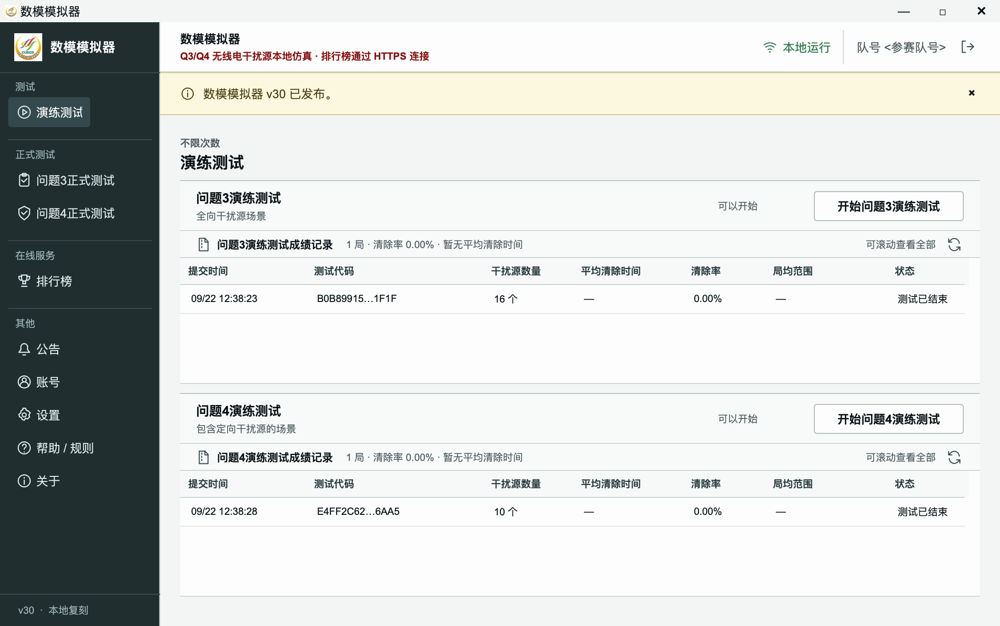
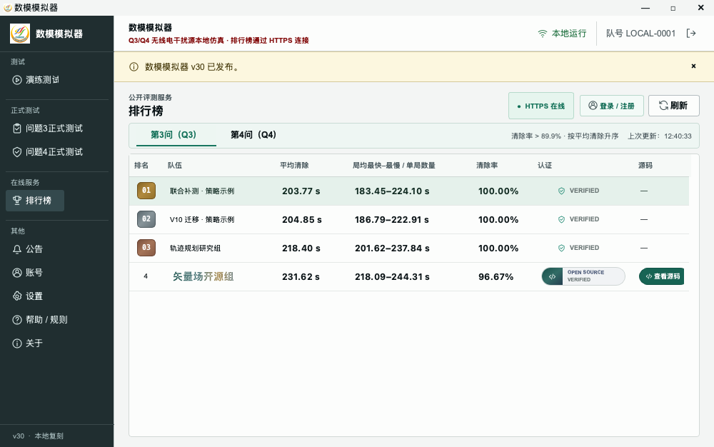

# 2026数模B题模拟器 v30

Q3/Q4 Simulator 是一个面向机器狗策略开发的桌面客户端项目，提供官方风格的本地测试界面、
`127.0.0.1:2026` HTTP 客户端协议兼容层，以及通过 HTTPS 访问的 Q3/Q4 排行榜。

> 本项目是社区开发工具，不是竞赛官方软件，也不代表竞赛主办方。



## 功能

- macOS 与 Windows 共用 PySide6/Qt GUI 源码
- Q3、Q4 测试生命周期与指令反馈表
- `POST /enter`、`POST /measure`、`POST /clear`、`POST /exit`
- Q3/Q4 独立排行榜
- 账号、队伍、提交历史和 Open Source Verified 展示
- 排行榜断网时不影响本地客户端界面



## 公开源码范围

本仓库公开桌面界面、HTTP 传输层、排行榜 HTTPS 客户端、跨平台适配、示例机器狗客户端和文档。

为保护评测完整性，下列内容不在本仓库中：

- Q3/Q4 场景生成器及其参数
- physics 与 ErrorField 实现
- replay、golden scenes 和隐藏评测数据
- 排行榜 evaluator 的隐藏场景与认证运行环境

从源码启动可以开发和查看桌面界面、排行榜及公开客户端代码；本地 Q3/Q4 仿真需要官方桌面构建中
随附的非公开 runtime。本仓库不以删除文件后的旧历史发布，因此私有 core 从未进入公开 Git 历史。

完整边界见 [公开与私有边界](docs/private-core-boundary.md)。

## 从源码打开公开客户端

需要 Python 3.11 或 3.12：

```bash
python -m venv .venv
python -m pip install -r requirements.txt
python app.py
```

源码检出版本不包含本地仿真 core。正式桌面安装包将在项目进入发布阶段后通过 GitHub Releases 提供。

## 排名规则

- 清除率严格大于 `89.9%` 的成绩进入达标组
- 达标组按平均清除时间升序排列
- 未达标组整体置后
- 多局先计算每局平均清除时间，再对各局等权平均
- 多局展示“局均最快–局均最慢”，单局展示干扰源数量
- 总时间不展示，也不参与排名

详见 [排行榜规则](docs/ranking-rules.md)。

## 文档

- [架构说明](docs/architecture.md)
- [本地 HTTP API](docs/http-api.md)
- [排行榜规则](docs/ranking-rules.md)
- [公开与私有边界](docs/private-core-boundary.md)
- [贡献说明](CONTRIBUTING.md)
- [安全报告](SECURITY.md)

## License

本仓库中的公开源码使用 [Apache License 2.0](LICENSE)。该许可证不适用于未包含在本仓库中的
私有 simulator core、隐藏数据、评测服务、官方二进制附带的第三方组件或竞赛主办方材料。
